<div align="center">

<!-- Gradient Header with SVG -->


<br/>

<!-- Animated Badge Row -->
<p>
  
  
  
  
</p>

<!-- Typing SVG -->
<a href="https://git.io/typing-svg"></a>

<br/><br/>

<!-- Stats Cards with Gradient -->
<table>
  <tr>
    <td align="center">
      
    </td>
    <td align="center">
      
    </td>
    <td align="center">
      
    </td>
  </tr>
</table>

<br/>

<!-- Navigation with Icons -->
<p>
  <a href="#-features">
    
  </a>
  <a href="#-screenshots">
    
  </a>
  <a href="#-installation">
    
  </a>
  <a href="#-tech-stack">
    
  </a>
  <a href="#-team">
    
  </a>
</p>

</div>

<br/>

<!-- Gradient Divider -->


<br/>

## 🎯 Problem Statement

<div align="center">
  
</div>

<br/>

Land pollution remains a critical challenge in university campuses, with traditional cleanup campaigns failing to create lasting behavioral change. Students lack incentives to recycle consistently, and existing programs don't leverage the mobile-first lifestyle of modern college students.

## 💡 The Solution

<div align="center">
  
</div>

<br/>

**AdBeam Mobile** is an innovative React Native application that gamifies recycling by rewarding students with redeemable points for scanning recyclable items. By making recycling as simple as taking a photo and as rewarding as earning credits toward campus perks, we're building sustainable habits that extend beyond graduation.

<br/>

<!-- Gradient Divider -->


<br/>

## ⚡ Features

<!-- Feature Grid with SVG Icons -->
<table>
  <tr>
    <td width="50%" valign="top">
      
### 🎥 **Instant Barcode Scanning**

```diff
+ Real-time camera integration using Expo Camera
+ Advanced barcode recognition for recyclable items
+ Material type classification (Paper, Plastic, Glass, Aluminum)
+ Duplicate detection to prevent abuse
+ Works in low-light conditions with flash support
```

### 💰 **Smart Points & Rewards System**

```yaml
Points per Material:
  📄 Paper/Cardboard: +3 points
  🍾 Plastic Bottles: +5 points
  🥫 Aluminum Cans: +7 points
  🍷 Glass Bottles: +10 points
```

- Real-time point accumulation
- 57 progressive levels with increasing thresholds
- Rewards marketplace with campus perks
- QR-based voucher redemption system

### 📊 **Comprehensive Dashboards**

#### 👤 **User Dashboard**
- Real-time eco-points and level progress
- Weekly recycling stats with percentage changes
- Campus leaderboard ranking with streak tracking
- Environmental impact metrics (CO₂ saved)
- Live weather and air quality data (OpenWeather API)
- Environmental news feed integration

    </td>
    <td width="50%" valign="top">

#### 👨‍💼 **Admin Dashboard**
- Total users, items recycled, and points analytics
- Top recyclers leaderboard with detailed stats
- Rewards management (create, edit, delete, stock control)
- User management with role assignment (User/Staff/Admin)
- Bonus event creation for engagement campaigns
- Real-time system overview with beautiful visualizations

#### 👷 **Staff Dashboard**
- Dedicated voucher scanner for reward redemption
- QR code verification system
- Real-time redemption processing
- Transaction history tracking

### 🎮 **Gamification Elements**
- **Streak Tracking:** Consecutive recycling days bonus
- **Achievement Badges:** Milestone celebrations
- **Campus Leaderboard:** Competitive rankings
- **Level Progression:** 57 levels of eco-warrior advancement
- **Social Sharing:** Share environmental impact achievements

### 🔔 **Smart Notifications**
- Welcome notifications for new users
- Scan reminders to maintain streaks
- Reward alerts when new perks are available
- Achievement badges celebrations
- Leaderboard updates and competitions
- Weekly recycling impact summaries
- **48+ push notifications** for maximum engagement

    </td>
  </tr>
</table>

### 🎨 **Beautiful UI/UX**

<div align="center">

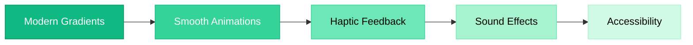
```mermaid
graph LR
    A[Modern Gradients] --> B[Smooth Animations]
    B --> C[Haptic Feedback]
    C --> D[Sound Effects]
    D --> E[Accessibility]
    style A fill:#10b981,stroke:#059669,color:#fff
    style B fill:#34d399,stroke:#10b981,color:#fff
    style C fill:#6ee7b7,stroke:#34d399,color:#000
    style D fill:#a7f3d0,stroke:#6ee7b7,color:#000
    style E fill:#d1fae5,stroke:#a7f3d0,color:#000
```

</div>

- Modern gradient-based design system
- Smooth animations and transitions
- Haptic feedback for tactile responses
- Sound effects for actions and alerts
- Dark mode support (coming soon)
- Accessibility features (VoiceOver, high contrast)

### 🔐 **Security & Authentication**

```typescript
Authentication {
  Provider: "Firebase Auth",
  Methods: ["Email/Password", "Password Reset"],
  Security: {
    RoleBasedAccess: true,
    Encryption: "HTTPS",
    LocalStorage: "Secure",
    DatabaseRules: "Strict"
  }
}
```

- Anti-fraud barcode locking system
- Role-based access control (User/Staff/Admin)

<br/>

<!-- Gradient Divider -->


<br/>

## 📸 Screenshots

<!-- Screenshots Section Header with Gradient -->
<div align="center">
  
</div>

<br/>

### 👤 User Dashboard

<div align="center">
  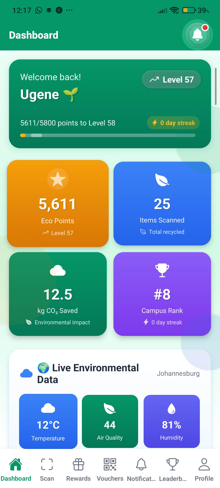
  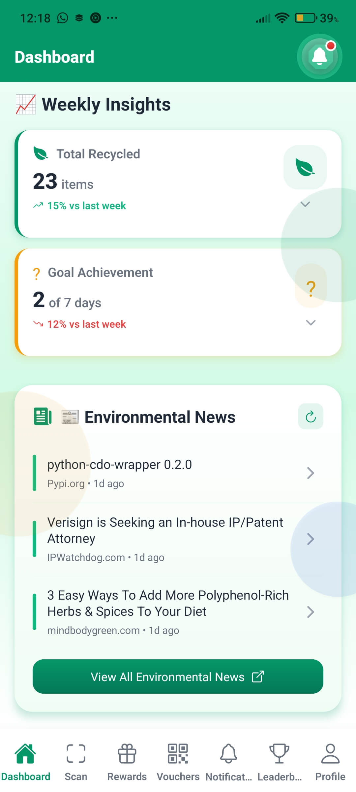
  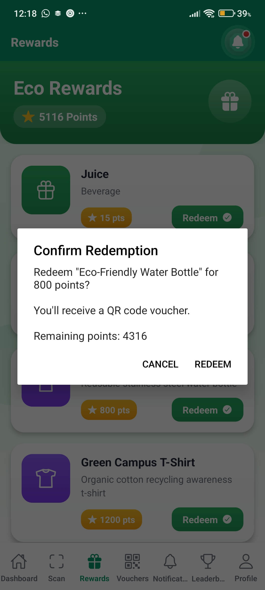
</div>

<div align="center">
  
  
  
  
</div>

<br/>

### 📸 Scanner Experience

<div align="center">
  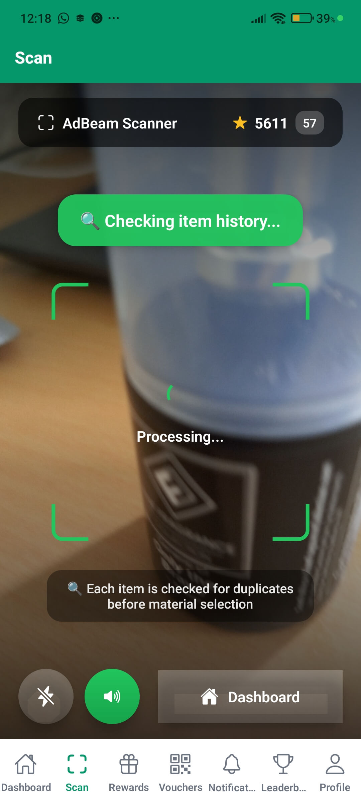
  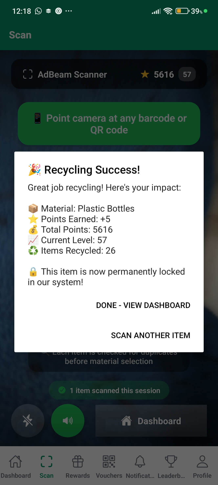
  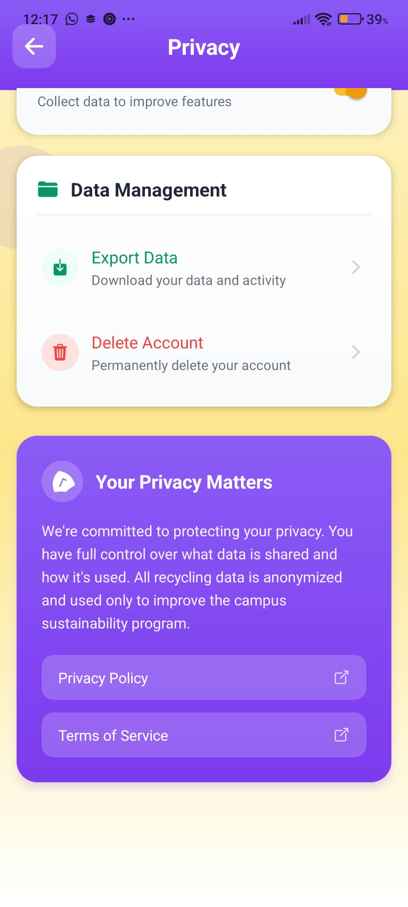
</div>

<p align="center">
  
  
  
  
</p>

<br/>

### 🎁 Rewards & Vouchers

<div align="center">
  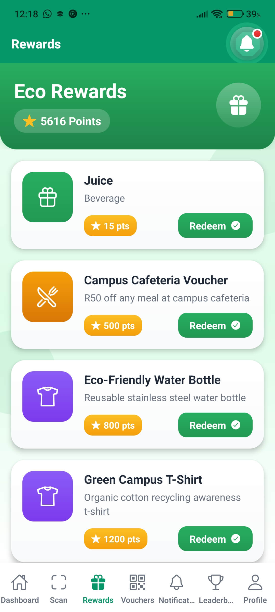
  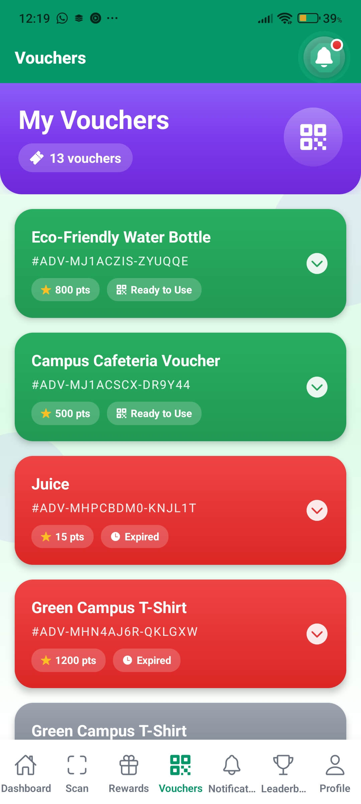
  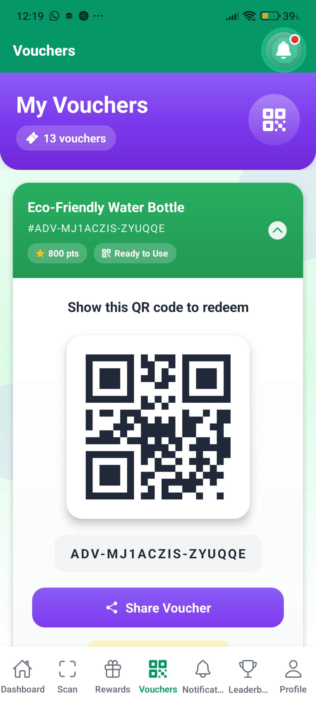
</div>

<p align="center">
  
  
</p>

<br/>

### 👨‍💼 Admin Dashboard & Management

<div align="center">
  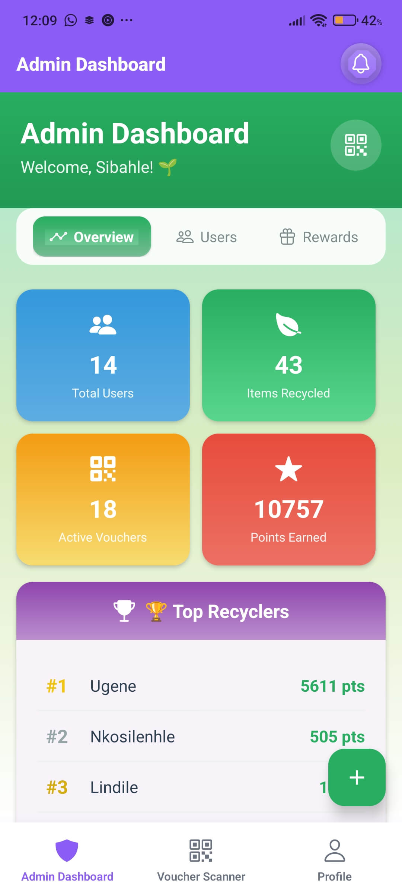
  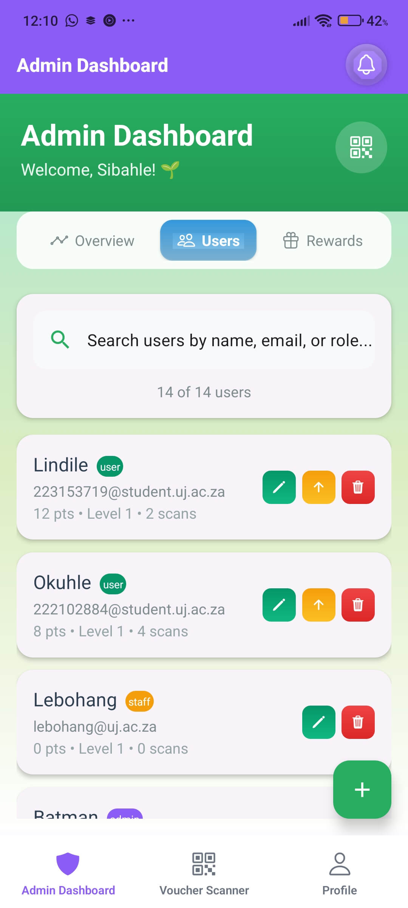
  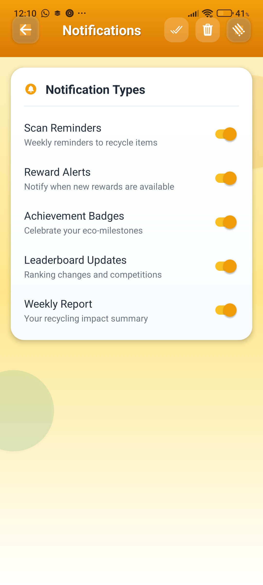
</div>

<div align="center">
  
  
  
</div>

<br/>

### ➕ Create & Edit Rewards

<div align="center">
  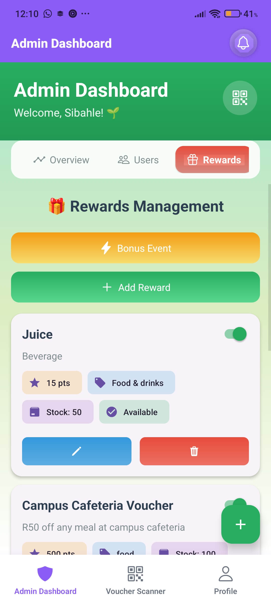
  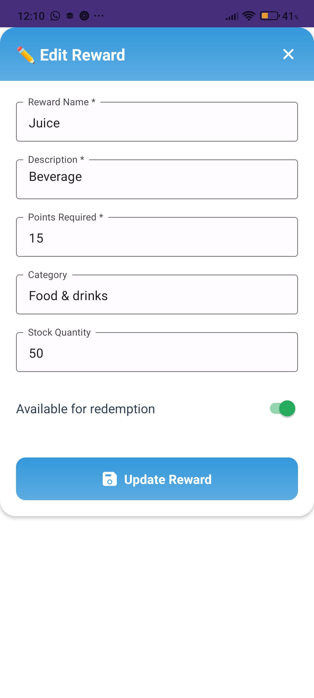
  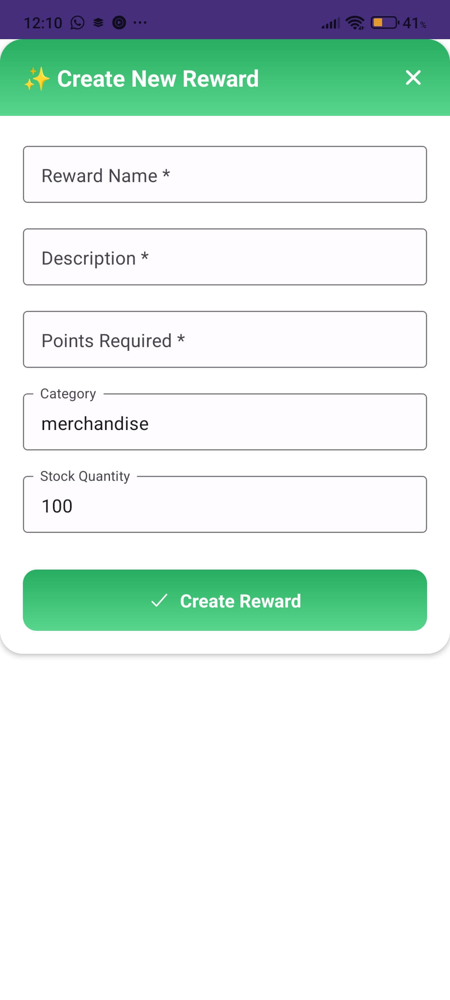
</div>

<br/>

### 👤 Profile & Settings

<div align="center">
  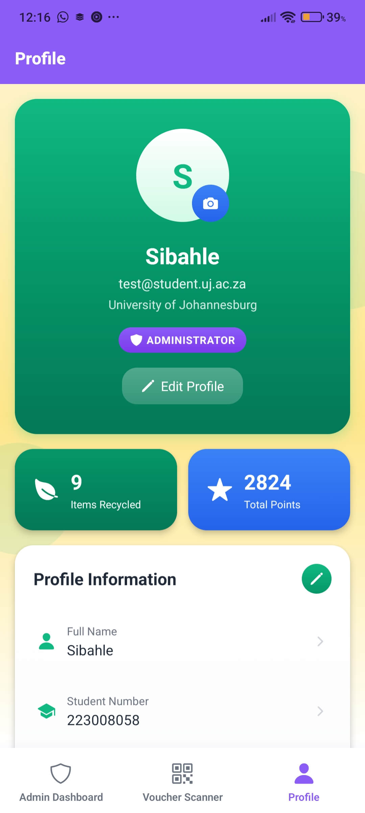
  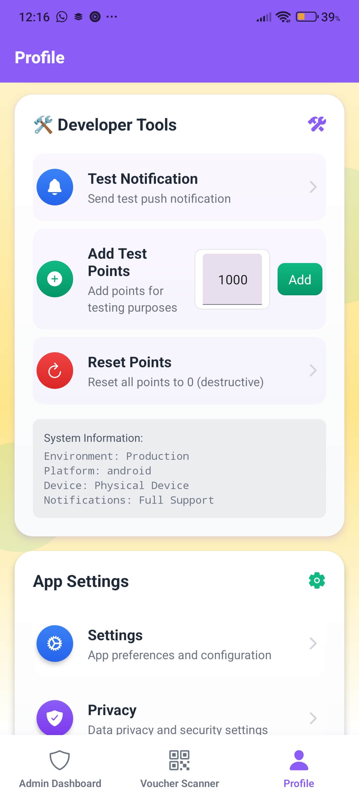
  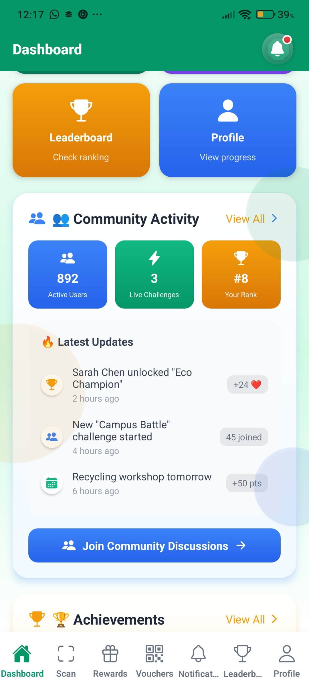
</div>

<br/>

### ⚙️ App Settings & Configuration

<div align="center">
  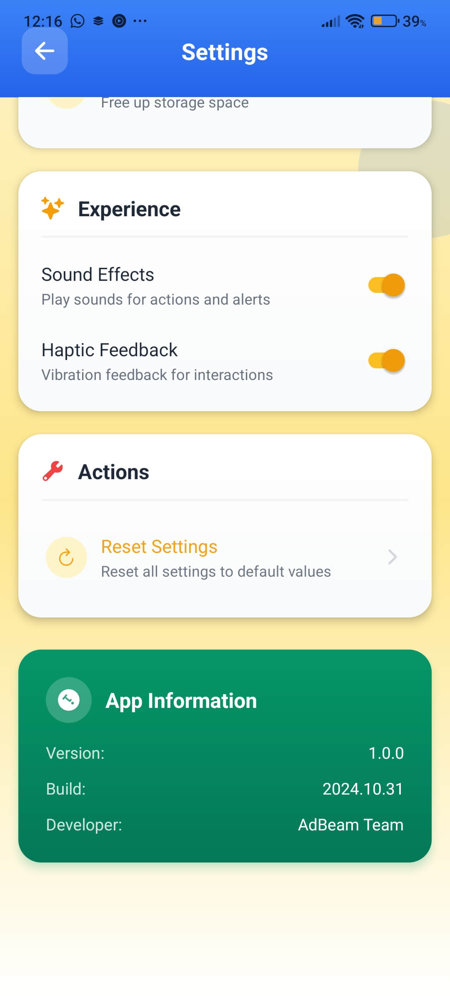
  
  
</div>

<br/>

### 👷 Staff Voucher Scanner

<div align="center">
  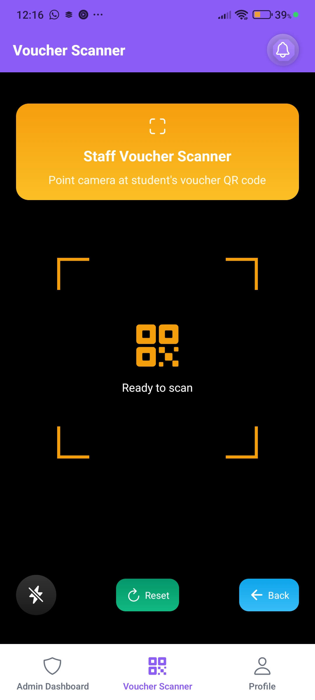
  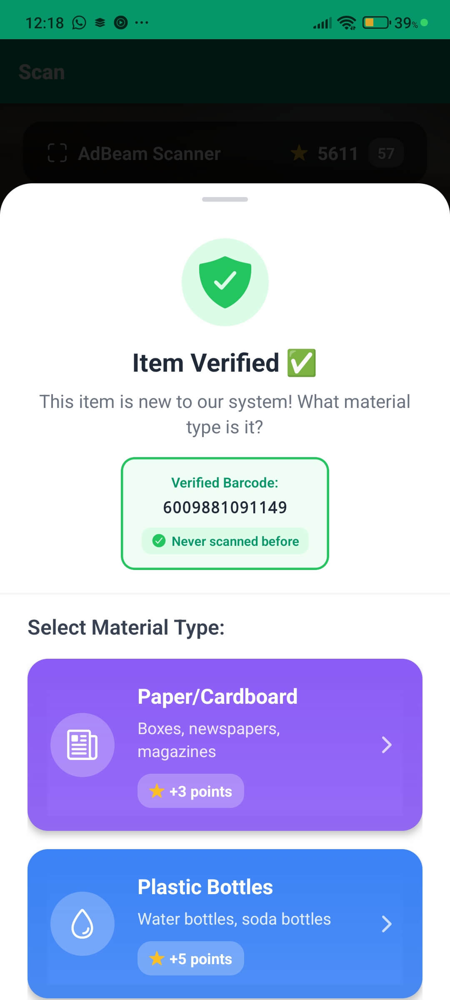
  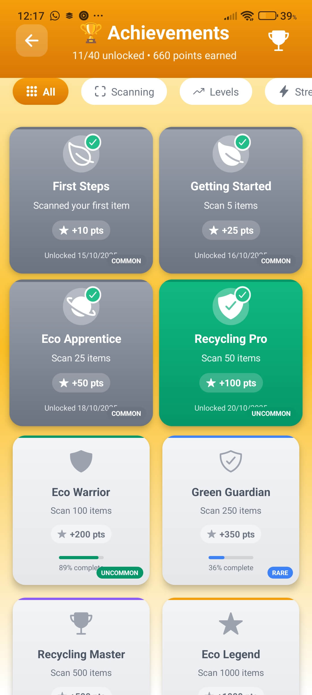
</div>

<br/>

<!-- Gradient Divider -->


<br/>

## 🛠️ Tech Stack

<div align="center">

### Frontend Technologies

<p>
  
</p>

### Backend & Services

<p>
  
</p>

### Development Tools

<p>
  
</p>

</div>

<br/>

<table width="100%">
  <tr>
    <td width="33%" valign="top">
      
**Frontend**
- React Native
- Expo SDK 50
- React Navigation
- Expo Camera
- Linear Gradient
- Expo Notifications
- Expo Haptics
- Expo AV

</td>
<td width="33%" valign="top">

**Backend & Services**
- Firebase Authentication
- Firebase Realtime Database
- Firestore
- OpenWeather API
- GNews API

</td>
<td width="33%" valign="top">

**Development Tools**
- Expo CLI
- EAS Build
- Git & GitHub
- VS Code
- IntelliJ IDEA
- Android Studio

</td>
  </tr>
</table>

<br/>

<!-- Gradient Divider -->


<br/>

## 📦 Installation

<div align="center">
  
  
  
</div>

<br/>

### Prerequisites
- Node.js (v16+)
- npm or yarn
- Expo CLI (`npm install -g expo-cli`)
- Android Studio (for Android) or Xcode (for iOS)
- Physical device or emulator

### Quick Start

```bash
# Clone the repository
git clone https://github.com/siba18k/Adbeam_Recycling_MobileApp_V2.git

# Navigate to project directory
cd Adbeam_Recycling_MobileApp_V2

# Install dependencies
npm install
# or
yarn install

# Start the development server
npx expo start

# Run on Android
npx expo run:android

# Run on iOS
npx expo run:ios
```

### Firebase Configuration

1. Create a Firebase project at [console.firebase.google.com](https://console.firebase.google.com)
2. Enable Authentication (Email/Password)
3. Create Realtime Database and Firestore
4. Copy your Firebase config to `src/config/firebase.js`
5. Set up Firebase rules from `firebase-rules.json`

```javascript
// src/config/firebase.js
export const firebaseConfig = {
  apiKey: "YOUR_API_KEY",
  authDomain: "YOUR_AUTH_DOMAIN",
  databaseURL: "YOUR_DATABASE_URL",
  projectId: "YOUR_PROJECT_ID",
  storageBucket: "YOUR_STORAGE_BUCKET",
  messagingSenderId: "YOUR_MESSAGING_SENDER_ID",
  appId: "YOUR_APP_ID"
};
```

### Environment Variables

Create a `.env` file in the root directory:

```env
OPENWEATHER_API_KEY=your_openweather_api_key
GNEWS_API_KEY=your_gnews_api_key
```

<br/>

<!-- Gradient Divider -->


<br/>

## 🏗️ Building for Production

### Android APK

```bash
# Install EAS CLI
npm install -g eas-cli

# Login to Expo
eas login

# Configure build
eas build:configure

# Build APK
eas build --platform android --profile preview
```

### iOS IPA

```bash
# Build for iOS
eas build --platform ios --profile production
```

<br/>

<!-- Gradient Divider -->


<br/>

## 🎮 How It Works

<div align="center">

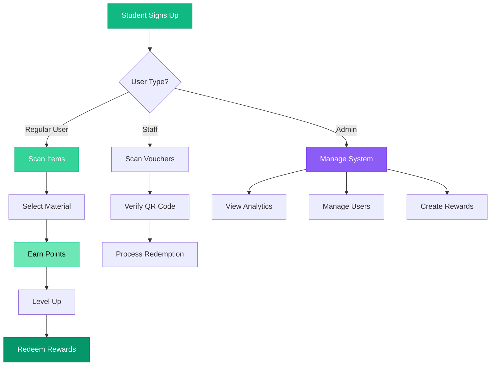
```mermaid
flowchart TD
    A[Student Signs Up] --> B{User Type?}
    B -->|Regular User| C[Scan Items]
    B -->|Staff| D[Scan Vouchers]
    B -->|Admin| E[Manage System]
    C --> F[Select Material]
    F --> G[Earn Points]
    G --> H[Level Up]
    H --> I[Redeem Rewards]
    D --> J[Verify QR Code]
    J --> K[Process Redemption]
    E --> L[View Analytics]
    E --> M[Manage Users]
    E --> N[Create Rewards]
    style A fill:#10b981,stroke:#059669,color:#fff
    style C fill:#34d399,stroke:#10b981,color:#fff
    style G fill:#6ee7b7,stroke:#34d399,color:#000
    style I fill:#059669,stroke:#047857,color:#fff
    style E fill:#8b5cf6,stroke:#7c3aed,color:#fff
```

</div>

<br/>

### For Students (Users)

1. **Sign Up** with your university email (@student.uj.ac.za)
2. **Scan** recyclable items using the in-app camera
3. **Select** material type (Paper, Plastic, Glass, Aluminum)
4. **Earn** points instantly based on material value
5. **Level Up** through 57 progressive ranks
6. **Redeem** rewards at the campus marketplace
7. **Compete** on the campus leaderboard
8. **Track** your environmental impact in real-time

### For Staff

1. **Login** with staff credentials
2. **Access** the voucher scanner
3. **Scan** student QR codes to redeem rewards
4. **Verify** voucher authenticity
5. **Process** redemptions in real-time

### For Administrators

1. **Login** with admin credentials
2. **Monitor** system-wide analytics
3. **Manage** users, rewards, and vouchers
4. **Create** bonus events and campaigns
5. **Assign** roles (User/Staff/Admin)
6. **Track** campus recycling trends

<br/>

<!-- Gradient Divider -->


<br/>

## 📊 Key Metrics

<div align="center">

<table>
  <tr>
    <td align="center">
      
    </td>
    <td align="center">
      
    </td>
    <td align="center">
      
    </td>
  </tr>
  <tr>
    <td align="center">
      
    </td>
    <td align="center">
      
    </td>
    <td align="center">
      
    </td>
  </tr>
</table>

</div>

<br/>

<!-- Gradient Divider -->


<br/>

## 🔐 Security Features

<div align="center">

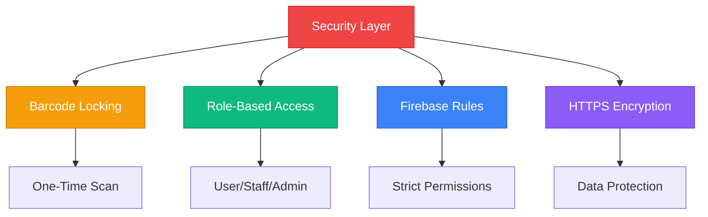
```mermaid
graph TD
    A[Security Layer] --> B[Barcode Locking]
    A --> C[Role-Based Access]
    A --> D[Firebase Rules]
    A --> E[HTTPS Encryption]
    B --> F[One-Time Scan]
    C --> G[User/Staff/Admin]
    D --> H[Strict Permissions]
    E --> I[Data Protection]
    style A fill:#ef4444,stroke:#dc2626,color:#fff
    style B fill:#f59e0b,stroke:#d97706,color:#fff
    style C fill:#10b981,stroke:#059669,color:#fff
    style D fill:#3b82f6,stroke:#2563eb,color:#fff
    style E fill:#8b5cf6,stroke:#7c3aed,color:#fff
```

</div>

- **Barcode Locking:** Items can only be scanned once to prevent abuse
- **Geolocation Verification:** Campus boundary enforcement (future)
- **Role-Based Access:** Three-tier permission system (User/Staff/Admin)
- **Firebase Rules:** Strict database read/write permissions
- **Encrypted Communications:** All data transmitted via HTTPS
- **Biometric Auth:** Fingerprint/Face ID support (planned)

<br/>

<!-- Gradient Divider -->


<br/>

## 🗺️ Roadmap

<div align="center">

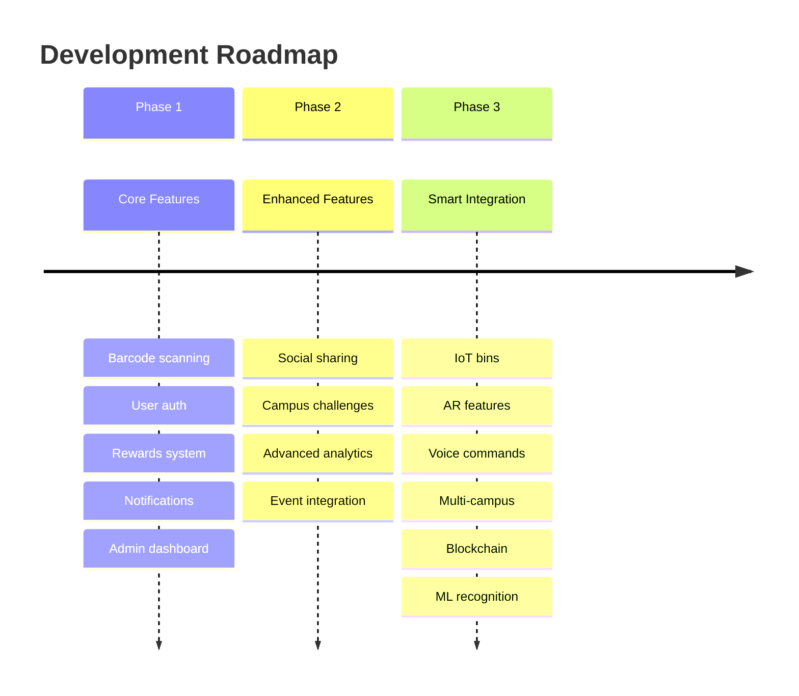
```mermaid
timeline
    title Development Roadmap
    section Phase 1
        Core Features : Barcode scanning : User auth : Rewards system : Notifications : Admin dashboard
    section Phase 2
        Enhanced Features : Social sharing : Campus challenges : Advanced analytics : Event integration
    section Phase 3
        Smart Integration : IoT bins : AR features : Voice commands : Multi-campus : Blockchain : ML recognition
```

</div>

<br/>

### ✅ Phase 1: Core Functionality (Complete)
- ✅ Barcode scanning with real camera integration
- ✅ User registration and authentication
- ✅ Basic rewards redemption
- ✅ Push notification system
- ✅ Admin dashboard with analytics
- ✅ Staff voucher scanner
- ✅ Developer testing tools

### 🚧 Phase 2: Enhanced Features (In Progress)
- 🚧 Social features for sharing achievements
- 🚧 Campus recycling challenges and competitions
- 🚧 Advanced analytics and impact visualization
- 🚧 Integration with campus event systems

### 🔮 Phase 3: Smart Integration (Planned)
- 🔮 IoT integration with smart recycling bins
- 🔮 AR features for identifying recyclable items
- 🔮 Voice commands for accessibility
- 🔮 Multi-campus deployment
- 🔮 Blockchain-based credit verification
- 🔮 Machine learning for improved item recognition

<br/>

<!-- Gradient Divider -->


<br/>

## 👥 Team

### AdBeam Corporation

| Role | Name | Student Number | GitHub |
|------|------|---------------|--------|
| **Group Leader & Lead Developer** | ST Dube (Sibahle) | 223003057 | [@siba18k](https://github.com/siba18k) |
| **Developer** | L Mbokazi | 223153718 | [@lindilembokazi18](https://github.com/lindilembokazi18) |
| **Developer** | AD Mnamateli | 223029043 | [@0664956876](https://github.com/0664956876) |
| **Developer** | NW Dlamini | 224019401 | [@Nkosilenhle](https://github.com/Nkosilenhle) |
| **Developer** | LSM Masalesa (Lebohang) | 223014114 | [@Lebohang01](https://github.com/Lebohang01) |
| **Developer** | BG Simango | 224095653 | [@brad1409](https://github.com/brad1409) |

**Institution:** University of Johannesburg  
**Semester:** 2nd Semester 2025  
**Course:** Development Software (DSW)

<br/>

<!-- Gradient Divider -->


<br/>

## 🤝 Contributing

<div align="center">
  
  
</div>

<br/>

We welcome contributions from the UJ community! Here's how you can help:

1. Fork the repository
2. Create a feature branch (`git checkout -b feature/AmazingFeature`)
3. Commit your changes (`git commit -m 'Add some AmazingFeature'`)
4. Push to the branch (`git push origin feature/AmazingFeature`)
5. Open a Pull Request

<br/>

<!-- Gradient Divider -->


<br/>

## 📄 License

<div align="center">
  
</div>

<br/>

This project is licensed under the MIT License - see the [LICENSE](LICENSE) file for details.

<br/>

<!-- Gradient Divider -->


<br/>

## 🙏 Acknowledgments

- **University of Johannesburg** - For supporting sustainable campus initiatives
- **Firebase** - For providing robust backend infrastructure
- **Expo Team** - For an amazing React Native development platform
- **OpenWeather** - For environmental data API access
- **All Beta Testers** - For invaluable feedback and support

<br/>

<!-- Gradient Divider -->


<br/>

## 📞 Contact & Support

- **Project Repository:** [github.com/siba18k/Adbeam_Recycling_MobileApp_V2](https://github.com/siba18k/Adbeam_Recycling_MobileApp_V2)
- **Lead Developer:** Sibahle Dube
- **Direct Enquiries:** [dubesibahle4@gmail.com](mailto:dubesibahle4@gmail.com)
- **University Email:** [223003057@student.uj.ac.za](mailto:223003057@student.uj.ac.za)
- **Organization:** AdBeam Corporation

<br/>

<!-- Gradient Divider -->


<br/>

## 🌍 Impact Statement

<div align="center">

> *"When recycling becomes as easy as scanning a barcode, and as rewarding as earning credits toward meaningful rewards, environmental consciousness becomes a natural part of daily campus life."*

<br/>

**By leveraging the power of smartphones and mobile technology, we're not just reducing campus waste—we're building sustainable habits that students will carry with them long after graduation.**

<br/>


</div>

<br/>

<!-- Gradient Divider -->


<br/>

<div align="center">

### 🌱 Made with 💚 by AdBeam Corporation


<br/>

[](https://github.com/siba18k/Adbeam_Recycling_MobileApp_V2/stargazers)
[](https://github.com/siba18k/Adbeam_Recycling_MobileApp_V2/network/members)
[](https://github.com/siba18k/Adbeam_Recycling_MobileApp_V2/watchers)

</div>

<br/>

<!-- Animated Footer Wave -->

